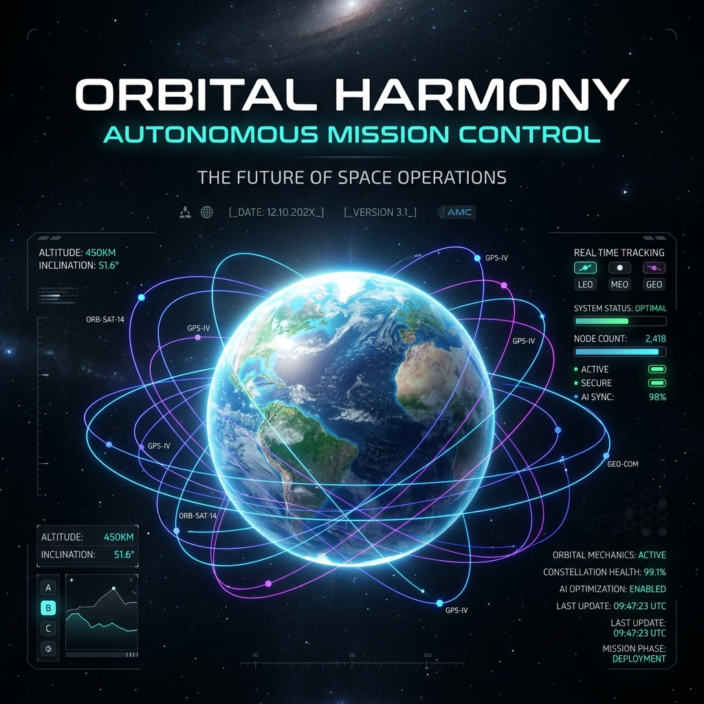
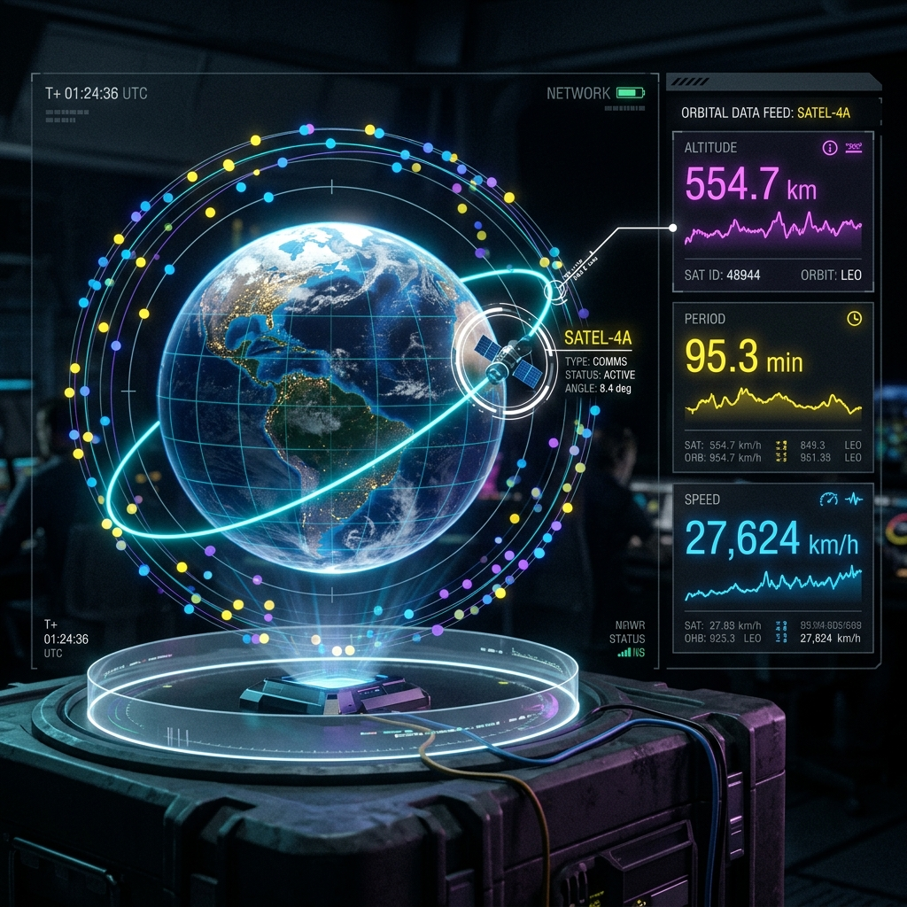
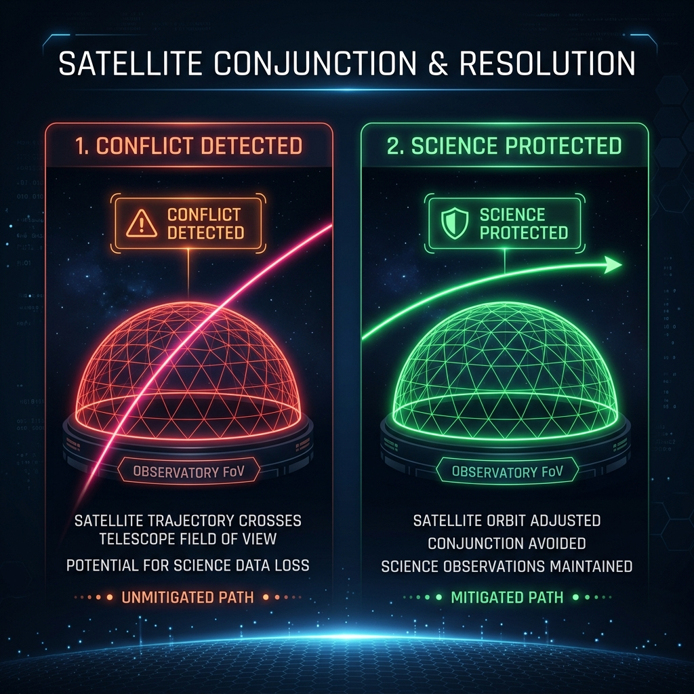

# Orbital Harmony 



This project contains both the frontend interface and the backend autonomous operations simulation for the **Orbital Harmony** system.

## Workspace Structure

The project has been divided into clean, specialized folders:

```
├── frontend/           # React, Vite, and TanStack Start frontend app
├── backend/            # Python CLI orbital simulation optimization loop
└── presentation/       # Presentation deck images, diagrams, and HTML manuals
```

---

## ⚙️ System Procedure & Operational Workflow

Orbital Harmony protects astronomical observations from satellite constellation interference through an automated, four-step scheduling optimization pipeline:

1. **Observation Queue Ingestion**: 
   The system loads telescope schedules containing coordinates (Right Ascension/Declination) and priority tiers (e.g., Tier 3 for irreplaceable planetary defense vs. Tier 1 for low-priority transits).
2. **Real-time Satellite Propagation**:
   Ingests active two-line element (TLE) catalog data and utilizes Keplerian orbital mechanics (approximating altitude via Kepler's Third Law) to compute precise coordinates relative to the observatories.
3. **Conjunction Assessment & Intersection Check**:
   Calculates telescope field-of-view (FOV) cones. If a satellite's vector intersects a telescope's 1.5° pointing cone while the satellite is above the horizon (>10° elevation), it flags a conflict and computes a collision probability.
4. **Priority-Based Schedule Shift**:
   If conflict probability exceeds tolerance, the optimization engine evaluates alternate time slots. It shifts the observation window (typically 5 to 20 minutes) to resolve the conflict without displacing higher-tier observations, preserving scientific data.

---

## 🖥️ Frontend (Vite / React / TanStack Start)

The frontend contains the interactive 3D Orbital Globe, live telemetry HUDs, and the Mission Control interface.



### Running Frontend Locally

1. Navigate to the `frontend/` directory:
   ```bash
   cd frontend
   ```
2. Install dependencies (using Bun or npm):
   ```bash
   bun install
   # or
   npm install
   ```
3. Run the development server:
   ```bash
   bun run dev
   # or
   npm run dev
   ```
4. Open the displayed URL (typically `http://localhost:3000`) in your browser.

---

## 🐍 Backend (Python CLI Simulation)

The backend is a high-fidelity Python simulation engine that handles Keplerian orbital propagation, Line-of-Sight (LOS) conjunction calculations, and priority-guided timeline optimization. It is built using clean, self-contained modular components.



### Core Architectural Modules

- **`models.py` (Data Layer)**: Defines strongly typed dataclasses representing the system objects (`Observatory`, `Observation`, `Satellite`, `InterferenceEvent`, and `ScheduleDecision`).
- **`config.py` (Observatory Profiles)**: Stores geographic parameters (Latitude/Longitude, elevation, aperture size) of ground-based telescope networks (e.g., Hanle and Devasthal).
- **`data/` (Ingestion Engines)**:
  - `tle_loader.py`: Ingests satellite orbital catalogs in standard two-line element format (TLE).
  - `observations.py`: Loads tonight's scheduled observation queues.
- **`physics/` (Celestial Mechanics)**:
  - `propagation.py`: Solves orbital geometries. Uses Kepler's Third Law (\(T = 2\pi\sqrt{a^3/\mu}\)) to derive altitude and period, executing circular orbit state propagation over the simulation epoch.
  - `solar.py`: Determines solar elevation angles to check if a satellite is illuminated by the sun (which causes scattering and ruins observations).
  - `interference.py`: Vector math engine. Computes look angles (Azimuth/Elevation) from ground stations. Flags intersections where the angular offset from the telescope's pointing cone is \(< 1.5^\circ\) and the satellite elevation is above the local horizon (\(> 10^\circ\)).
- **`scheduler/` (Heuristics Optimization)**:
  - `optimizer.py`: A priority scheduler. When a conflict is flagged, it runs a constraint search to shift the observation window, ensuring the new window is clear of satellite crossings and does not overwrite higher-tier observations.
  - `explain.py`: Renders natural language logs of the scheduler's decision reasoning trace (e.g. why an shift was applied, confidence levels).
- **`output/` (Telemetry Dashboard & Analysis)**:
  - `dashboard.py`: Renders the terminal HUD displaying autonomous tracking metrics.
  - `metrics.py`: Computes high-level analytics, including the *Scientific Recovery Rate*, *Hours Rescued*, and *Estimated Cost Avoided (USD)* based on aperture operational rates.

---

### Running Backend Locally

1. Navigate to the `backend/` directory:
   ```bash
   cd backend
   ```
2. Run the main simulation loop (requires Python 3.10+):
   ```bash
   python main.py
   ```
3. Run the unit tests suite:
   ```bash
   python -m unittest discover -s tests
   ```

No external pip dependencies are required. The simulation is fully self-contained.

---

## 👥 Contributors

This project is co-developed and maintained by:
- **amg-xai** (Frontend Architecture)
- **watashiwa01** (Backend Mechanics & Workspace Operations)
